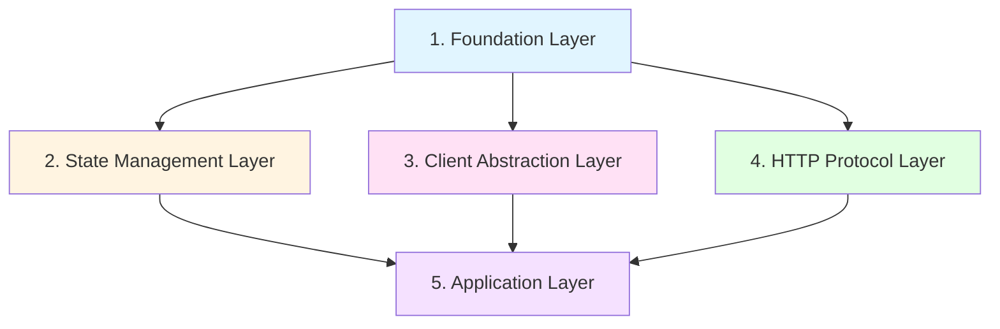
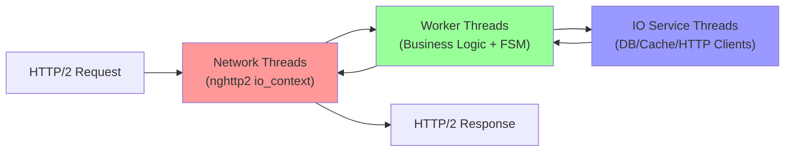

# Astra - Architecture & Design Document

> **Version**: 1.0.0  
> **Last Updated**: 2025-12-02  
> **Status**: Living Document

---

## Table of Contents

1. [System Overview](#system-overview)
2. [Architectural Principles](#architectural-principles)
3. [Layered Architecture](#layered-architecture)
4. [Threading Model & SEDA](#threading-model--seda)
5. [Component Catalog](#component-catalog)
6. [Design Patterns](#design-patterns)
7. [Build & Deployment](#build--deployment)
8. [Quality Assurance](#quality-assurance)
9. [Performance Goals](#performance-goals)

---

## System Overview

### Vision

**Astra** is a **cloud-native, high-performance HTTP/2 microservice platform** built in C++17, designed to achieve **1M+ TPS** (Transactions Per Second) through horizontal pod scaling and a non-blocking, staged event-driven architecture (SEDA).

### Core Objectives

- **Performance**: Target 1M+ TPS distributed across horizontally scaled pods
- **Reliability**: Production-grade stability through defensive programming and comprehensive testing
- **Maintainability**: Clean, testable code that prioritizes longevity over feature velocity
- **Scalability**: Cloud-native design optimized for Kubernetes HPA (Horizontal Pod Autoscaler)

### Technology Stack

| Layer | Technology |
|:------|:-----------|
| **Language** | C++17 (modern features, no C++20 coroutines yet) |
| **Build System** | CMake 3.25+ with Ninja generator |
| **HTTP/2 Library** | nghttp2-asio (Boost.Asio integration) |
| **HTTP/1.1 Library** | Custom implementation |
| **State Machines** | HFSM2, Boost.MSM |
| **Databases** | MongoDB, Redis, ZooKeeper (abstracted clients) |
| **Testing** | GoogleTest, CTest |
| **Sanitizers** | ASan, TSan, MSan, UBSan (Clang/GCC) |
| **Profiling** | Valgrind (Memcheck, Helgrind, Massif, Callgrind, Cachegrind) |
| **Monitoring** | Prometheus client |
| **Containerization** | Docker (Ubuntu 25.10 base) |
| **Platform** | **Linux-only** (uses inotify, epoll, Linux-specific syscalls) |

---

## Architectural Principles

Astra's design is governed by **mandatory philosophies** from four foundational books:

### 1. Clean Architecture (Robert C. Martin)

- **Dependency Rule**: Dependencies point inward; core business logic is isolated from frameworks and IO
- **Separation of Concerns**: Clear boundaries between layers (domain, application, infrastructure)
- **Interface Segregation**: Small, focused interfaces (e.g., `IWorkerPool`, `IMongoClient`)
- **Plug-and-Play**: Swap HTTP/1.1 ↔ HTTP/2 or database implementations without changing business logic

### 2. Release It! (Michael Nygard)

- **Bulkheads**: Thread pools isolate failures (Network threads ≠ Worker threads ≠ IO Service threads)
- **Fail Fast**: Use `[[nodiscard]]` and early validation to detect errors at boundaries
- **Circuit Breakers**: (Planned) Prevent cascading failures in distributed calls
- **Stability Patterns**: Backpressure via bounded queues, timeouts on all blocking operations

### 3. Effective Modern C++ (Scott Meyers)

- **RAII**: All resources managed via smart pointers (`std::unique_ptr`, `std::shared_ptr`, `std::weak_ptr`)
- **Move Semantics**: Eliminate unnecessary copies, especially for `Job` and `Request`/`Response` objects
- **Type Safety**: Use `auto`, `constexpr`, `noexcept`, `std::string_view` for zero-copy string handling
- **No Raw Pointers**: Ownership is explicit; raw pointers are forbidden in explanations and code

### 4. Designing Data-Intensive Applications (Martin Kleppmann)

- **Scalability**: Horizontal scaling via pods, not vertical scaling via threads
- **Reliability**: Idempotent operations, eventual consistency where applicable
- **Maintainability**: Data-centric design with clear repository abstractions
- **Observability**: Prometheus metrics for monitoring system health

---

## Layered Architecture

Astra is organized into **5 architectural layers**, each with clear responsibilities:



### Layer 1: Foundation (Utilities)

**Purpose**: Core utilities used by all other layers.

| Component | Description | Key Files |
|:----------|:------------|:----------|
| **concurrency** | Thread pool abstractions with sharded and shared queue topologies | [`IWorkerPool.h`](file:///home/siddu/astra/concurrency/include/IWorkerPool.h), [`WorkerPool.h`](file:///home/siddu/astra/concurrency/include/WorkerPool.h), [`IoWorkerPool.h`](file:///home/siddu/astra/concurrency/include/IoWorkerPool.h) |
| **logger** | Structured logging | [`logger/include`](file:///home/siddu/astra/logger/include) |
| **exception** | Custom exception hierarchy | [`exception/include`](file:///home/siddu/astra/exception/include) |
| **jsonformatter** | JSON serialization/deserialization | [`jsonformatter/include`](file:///home/siddu/astra/jsonformatter/include) |
| **outcome** | Result types for error handling (alternative to exceptions) | [`outcome/CMakeLists.txt`](file:///home/siddu/astra/outcome/CMakeLists.txt) |
| **uuid_generator** | UUID generation for request tracing | [`uuid_generator`](file:///home/siddu/astra/uuid_generator) |

### Layer 2: State Management

**Purpose**: Finite state machines for managing stateful business logic.

| Component | Description | Key Files |
|:----------|:------------|:----------|
| **hfsm** | Wrapper for HFSM2 (Hierarchical Finite State Machine) | [`Machine.h`](file:///home/siddu/astra/hfsm/include/Machine.h) |
| **boost_msm** | Wrapper for Boost.MSM (Meta State Machine) | [`StateMachine.h`](file:///home/siddu/astra/boost_msm/include/StateMachine.h) |

> **Rationale**: State machines ensure FSM continuity across async IO operations. Worker threads own FSM state; IO responses must return to the **same worker thread** that initiated the request.

### Layer 3: Client Abstraction

**Purpose**: Abstracted interfaces for external dependencies (databases, caches, services).

| Component | Description | Key Files |
|:----------|:------------|:----------|
| **mongoclient** | MongoDB client abstraction | [`IMongoClient.h`](file:///home/siddu/astra/mongoclient/include/IMongoClient.h), [`MongoClient.h`](file:///home/siddu/astra/mongoclient/include/MongoClient.h) |
| **redisclient** | Redis client abstraction | [`redisclient/include`](file:///home/siddu/astra/redisclient/include) |
| **zookeeperclient** | ZooKeeper client abstraction | [`zookeeperclient/include`](file:///home/siddu/astra/zookeeperclient/include) |
| **prometheus_client** | Prometheus metrics exporter | [`prometheus_client/include`](file:///home/siddu/astra/prometheus_client/include) |

> **Design Principle**: Clients run on **IO Service Threads**, not worker threads. This isolates blocking operations and prevents worker thread starvation.

### Layer 4: HTTP Protocol

**Purpose**: HTTP/1.1 and HTTP/2 server/client implementations with a **plug-and-play interface**.

| Component | Description | Key Files |
|:----------|:------------|:----------|
| **http1.1** | HTTP/1.1 server implementation | [`http1.1/`](file:///home/siddu/astra/http1.1) |
| **http2/server** | HTTP/2 server (nghttp2-asio) | [`Http2Server.h`](file:///home/siddu/astra/http2/server/include/Http2Server.h) |
| **http2/client** | HTTP/2 client (connection multiplexing, 30s idle timeout) | [`http2/client/`](file:///home/siddu/astra/http2/client) |
| **router** | Trie-based URL router with middleware support | [`Router.h`](file:///home/siddu/astra/router/include/Router.h), [`Middleware.h`](file:///home/siddu/astra/router/include/Middleware.h) |

**Key Design Decisions**:
- **Minimal Interfaces**: Only `GET`, `POST`, `PUT`, `DELETE` methods; new features added only when needed
- **Connection Multiplexing** (HTTP/2): Clients reuse connections per IO service thread (no sharing, no locks)
- **Stateful Routing**: IO responses return to the **same worker thread** that initiated the request (FSM continuity)

### Layer 5: Application (Business Logic)

**Purpose**: Domain-specific business logic and services.

| Component | Description | Key Files |
|:----------|:------------|:----------|
| **uri_shortner** | Example microservice: URL shortening with MongoDB/Redis backends | [`UriService.h`](file:///home/siddu/astra/uri_shortner/include/UriService.h), [`UriController.h`](file:///home/siddu/astra/uri_shortner/include/UriController.h) |
| **server** | Main application entry point (future) | [`server/CMakeLists.txt`](file:///home/siddu/astra/server/CMakeLists.txt) |

---

## Threading Model & SEDA

Astra implements a **Staged Event-Driven Architecture (SEDA)** with strict thread role separation.

### Thread Roles



| Thread Type | Count (2-core pod) | Responsibilities | Queue Type |
|:------------|:-------------------|:-----------------|:-----------|
| **Network Threads** | Minimal (nghttp2) | IO, Parsing, Protocol Handling | N/A (event-driven) |
| **Worker Threads** | 1-2 | Business Logic, FSM State, Routing | **Sharded Queues** (`WorkerPool`) |
| **IO Service Threads** | 1 | HTTP Clients, DB, Cache | **Shared Queue** (`IoWorkerPool`) |

### Worker Pool Implementations

#### 1. WorkerPool (Sharded Queues)

**Use Case**: Business logic with session affinity (FSM continuity).

- **Topology**: Each worker thread has its own **private queue**
- **Routing**: Jobs routed by `job.session_id % num_threads`
- **Advantages**:
  - **Zero contention** between workers
  - **Cache locality** (same session → same core)
  - **FSM continuity** (state lives on one thread)

**Implementation**: [`WorkerPool.h`](file:///home/siddu/astra/concurrency/include/WorkerPool.h)

#### 2. IoWorkerPool (Shared Queue)

**Use Case**: IO-bound tasks with varying execution times.

- **Topology**: All threads share a **single queue** (work stealing)
- **Backpressure**: Bounded queue capacity (default: 10,000 jobs)
- **Advantages**:
  - **Load balancing** (idle threads steal work)
  - **Backpressure** (queue full → reject new work)

**Implementation**: [`IoWorkerPool.h`](file:///home/siddu/astra/concurrency/include/IoWorkerPool.h)

### Resource Constraints (Cloud Native)

- **2 CPU cores per application container** (4 total per pod including Istio sidecar)
- **Scale horizontally** (HPA), not vertically (more threads)
- **Build parallelism**: `-j2` (aligned with 2-core design)

---

## Component Catalog

### Router

**Purpose**: High-performance URL routing with middleware support.

**Key Features**:
- **Trie-based matching** with path parameters (e.g., `/users/:id`)
- **Middleware chain**: Runs before route handler (auth, logging, etc.)
- **Zero-copy matching**: Uses `std::string_view` to avoid allocations

**Files**: [`Router.h`](file:///home/siddu/astra/router/include/Router.h), [`Middleware.h`](file:///home/siddu/astra/router/include/Middleware.h)

**Example Usage**:

```cpp
router::Router router;
router.use(logging_middleware);
router.get("/users/:id", [](IRequest& req, IResponse& res) {
    auto id = req.params("id");
    res.send("User ID: " + std::string(id));
});
```

### HTTP/2 Server

**Purpose**: Production-grade HTTP/2 server using nghttp2-asio.

**Key Features**:
- **Asynchronous IO**: Boost.Asio event loop
- **Stream multiplexing**: Multiple requests per connection
- **Router integration**: Delegates to `router::Router`

**Files**: [`Http2Server.h`](file:///home/siddu/astra/http2/server/include/Http2Server.h)

**Patching**: nghttp2-asio patched for Boost 1.88 compatibility ([see patches](file:///home/siddu/astra/http2/nghttp2))

### MongoDB Client

**Purpose**: Abstracted MongoDB client for dependency inversion.

**Key Features**:
- **Interface-based** (`IMongoClient`)
- **CRUD operations**: `findOne`, `insertOne`, `insertMany`, `updateMany`, `deleteMany`, `find`
- **Uses MongoDB C Driver 2.1.2** (pre-built in Docker image)

**Files**: [`IMongoClient.h`](file:///home/siddu/astra/mongoclient/include/IMongoClient.h)

---

## Design Patterns

### 1. Dependency Inversion (Clean Architecture)

**All external dependencies behind interfaces**:
- `IWorkerPool` → `WorkerPool`, `IoWorkerPool`
- `IMongoClient` → `MongoClient`
- `IRequest`, `IResponse` → `Http2Request`, `Http2Response`

### 2. Factory Functions (No DI Frameworks)

**Simple factory functions over complex DI**:

```cpp
auto create_worker_pool(size_t threads) -> std::unique_ptr<IWorkerPool> {
    return std::make_unique<WorkerPool>(threads);
}
```

### 3. RAII (Resource Acquisition Is Initialization)

**All resources managed automatically**:
- **No raw `new`/`delete`**: Use `std::unique_ptr`, `std::shared_ptr`
- **Thread safety**: RAII guards (`std::lock_guard`, `std::unique_lock`)
- **Connection management**: Clients own connections via RAII

### 4. Repository Pattern (Data Access)

**URI Shortener example**:
- `IUriRepository` → `MongoUriRepository`, `RedisUriRepository`
- `UriService` depends on `IUriRepository`, not concrete implementations

**Files**: [`IUriRepository.h`](file:///home/siddu/astra/uri_shortner/include/IUriRepository.h)

### 5. Middleware Chain (Chain of Responsibility)

**Router middleware**:

```cpp
router.use(auth_middleware);
router.use(logging_middleware);
router.get("/protected", handler);
```

Execution order: `auth → logging → handler`

---

## Build & Deployment

### Build System

**CMake Presets** ([`CMakePresets.json`](file:///home/siddu/astra/CMakePresets.json)):

| Preset | Compiler | Build Type | Sanitizer |
|:-------|:---------|:-----------|:----------|
| `gcc-release` | GCC | Release | None |
| `gcc-debug` | GCC | Debug | None |
| `gcc-asan` | GCC | Debug | AddressSanitizer |
| `clang-asan` | Clang | Debug | AddressSanitizer |
| `clang-tsan` | Clang | Debug | ThreadSanitizer |
| `clang-msan` | Clang | Debug | MemorySanitizer |
| `clang-ubsan` | Clang | Debug | UndefinedBehavior |

**Build Commands**:

```bash
# Configure
cmake --preset gcc-debug

# Build (2 cores)
cmake --build --preset gcc-debug -j2

# Test
ctest --preset gcc-debug
```

**Clean Builds**:

```bash
# Incremental clean (keeps CMake cache)
ninja -C build/gcc-debug clean

# Full clean
rm -rf build/gcc-debug
```

### Containerization

**Dockerfile**: [`devenv/Dockerfile`](file:///home/siddu/astra/devenv/Dockerfile)

**Base Image**: Ubuntu 25.10

**Pre-installed Dependencies**:
- **Compilers**: GCC, Clang (with libc++)
- **Build Tools**: CMake, Ninja, pkg-config
- **Libraries**: Boost 1.88, nghttp2, libhiredis, OpenSSL, SASL2
- **MongoDB C Driver**: 2.1.2 (pre-built, ~25 min build time)
- **Debugging**: GDB, LLDB, Valgrind

**Build Image**:

```bash
docker build --network=host -t astrabuilder:v6 -f devenv/Dockerfile devenv
```

**Run Container**:

```bash
docker run -it --name astra -v $(pwd):/app/astra astrabuilder:v6 bash
```

**Container Workflow**:
- **ALL development inside container**: Build, test, git operations
- **Host commands**: Only `docker exec -it astra <command>`
- **Project path**: `/app/astra`

---

## Quality Assurance

### Testing Strategy

**Defense in Depth**: Multiple compilers and tools to catch bugs in development.

| Tool | Purpose | Command |
|:-----|:--------|:--------|
| **GoogleTest** | Unit tests | `ctest --preset gcc-debug` |
| **GCC ASan** | Memory safety | `cmake --build --preset gcc-asan` |
| **Clang TSan** | Thread safety | `cmake --build --preset clang-tsan` |
| **Valgrind Memcheck** | Memory leaks | `ninja -C build/gcc-debug test_memcheck` |
| **Valgrind Helgrind** | Data races | `ninja -C build/gcc-debug test_helgrind` |
| **Valgrind Massif** | Heap profiling | `ninja -C build/gcc-debug test_massif` |

### Test Organization

Each component has its own test suite:

```
component/
├── include/
├── src/
└── tests/
    ├── CMakeLists.txt
    └── component_test.cpp
```

**Example**: [`router/tests/router_gtest.cpp`](file:///home/siddu/astra/router/tests/router_gtest.cpp)

**Run specific test**:

```bash
cmake --build --preset gcc-debug --target router_gtest
./build/gcc-debug/router/tests/router_gtest --gtest_filter=RouterTest.ExactMatch
```

### Code Quality Standards

- **C++ Core Guidelines**: RAII, modern features, `[[nodiscard]]`, `noexcept`
- **No raw pointers**: Smart pointers mandatory
- **Production-level warnings**: `-Wall -Wextra -Wpedantic`
- **Mental Dry Run**: Review code 5+ times before compilation
- **Compilation is for verification**, not debugging

---

## Performance Goals

### Target

**1M+ TPS** (Transactions Per Second) distributed across horizontally scaled pods.

### Optimization Strategies

1. **Zero-copy string handling**: Use `std::string_view` for path matching
2. **Move semantics**: Eliminate copies for `Job`, `Request`, `Response`
3. **Cache locality**: Sharded queues ensure session affinity → same core
4. **Lock-free design**: Per-thread HTTP/2 clients (no sharing)
5. **Backpressure**: Bounded queues prevent OOM under load
6. **Horizontal scaling**: 2-core pods scaled via Kubernetes HPA

### Monitoring

**Prometheus metrics** (planned):
- Request latency (p50, p95, p99)
- Throughput (requests/sec)
- Queue depth (worker, IO service)
- Cache hit/miss rates
- HTTP/2 connection pool stats

---

## Configuration Strategy

### Current State: Hardcoded

**All parameters hardcoded** (timeouts, thread counts, connection pools).

**Rationale**: Avoid premature configuration complexity during core development.

### Future: Configuration Module

**Planned** (after core interfaces stabilize):
- **Format**: YAML or JSON
- **Hot reload**: Update without restart
- **Environment-based**: Dev, staging, production configs

**Example** (future):

```yaml
threading:
  worker_threads: 2
  io_service_threads: 1

http2_client:
  idle_timeout_sec: 30
  max_connections: 100

database:
  mongodb_uri: "mongodb://localhost:27017"
  connection_pool_size: 10
```

---

## Roadmap

### Completed ✅

- [x] Concurrency layer (WorkerPool, IoWorkerPool)
- [x] Router with trie-based matching and middleware
- [x] HTTP/2 server (nghttp2-asio)
- [x] HTTP/2 client (connection multiplexing)
- [x] MongoDB, Redis, ZooKeeper client abstractions
- [x] State machine wrappers (HFSM2, Boost.MSM)
- [x] Comprehensive testing (GTest, Sanitizers, Valgrind)
- [x] Docker build environment with pre-built MongoDB driver

### In Progress 🚧

- [ ] URI Shortener microservice (reference implementation)
- [ ] Main server integration (`server/`)
- [ ] Configuration module (YAML/JSON)

### Future 🔮

- [ ] Circuit breaker pattern (Release It!)
- [ ] Distributed tracing (OpenTelemetry)
- [ ] Kubernetes deployment manifests
- [ ] Performance benchmarking suite (wrk, k6)
- [ ] Load testing (verify 1M+ TPS target)

---

## References

### Mandatory Design Philosophies

1. **Clean Architecture** - Robert C. Martin
2. **Release It!** - Michael Nygard  
3. **Effective Modern C++** - Scott Meyers  
4. **Designing Data-Intensive Applications** - Martin Kleppmann

### Key Documents

- [USER_PREFERENCES.md](file:///home/siddu/astra/USER_PREFERENCES.md) - Development guidelines and mandatory philosophies
- [README.md](file:///home/siddu/astra/README.md) - Build instructions and quick start
- [NEXT_STEPS.md](file:///home/siddu/astra/NEXT_STEPS.md) - Recent changes and pending tasks

---

**End of Document**
